

  

<h1 align="center">Taller 03</h1>

  <strong>Revisión de antecedentes científicos y tecnológicos</strong> 
  Fundamentos de Diseño · Equipo 10 · 2026-2

---

## 1. Artículos científicos

### 1.1. *A Comparison of Food Portion Size Estimation Using Geometric Models and Depth Images*

  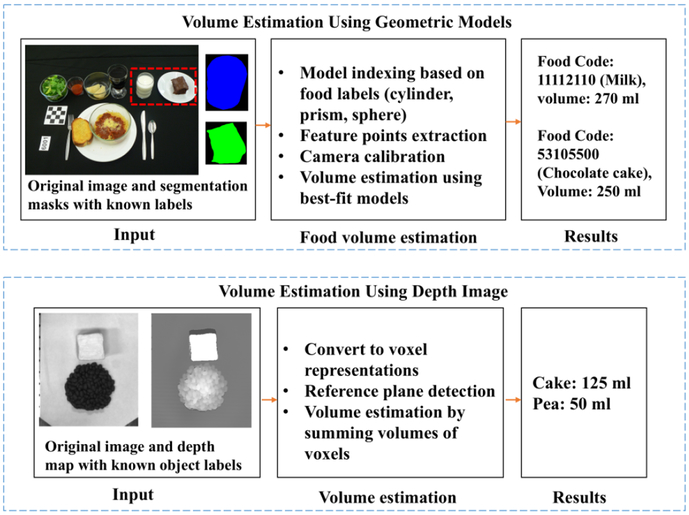

<em>Figura 1. Flujo de los dos métodos de estimación de volumen evaluados por Fang et al. Fuente: <a href="https://pmc.ncbi.nlm.nih.gov/articles/PMC6226035/">artículo original</a>.</em>

Fang et al. compararon dos maneras de calcular el volumen de una porción. La primera aproxima cada alimento a una forma conocida —por ejemplo, una esfera, un cilindro o un prisma— y ajusta sus dimensiones sobre la imagen. La segunda emplea un mapa de profundidad para representar el alimento mediante vóxeles y sumar el volumen ocupado [1].

La prueba se realizó con diez objetos de entre 50 y 450 mL. Los mapas de profundidad tuvieron una resolución de 640 × 480 píxeles. En nueve de los diez casos este método sobreestimó el volumen; el mayor desvío apareció en el vaso, cuya estimación promedio fue 2,34 veces el volumen real. Los modelos geométricos dieron resultados más cercanos cuando la forma del objeto estaba bien definida [1].

Para el proyecto, el artículo señala una limitación relevante: una fotografía no permite determinar por sí sola la cantidad de comida. La forma, el ángulo de captura, la segmentación y la referencia de escala modifican el resultado. Además, las pruebas se realizaron con réplicas y máscaras conocidas, de modo que sus cifras no representan el comportamiento ante platos reales o con varios alimentos.

### 1.2. *A Novel Approach to Estimate the Weight of Food Items Based on Features Extracted from an Image Using Boosting Algorithms*

  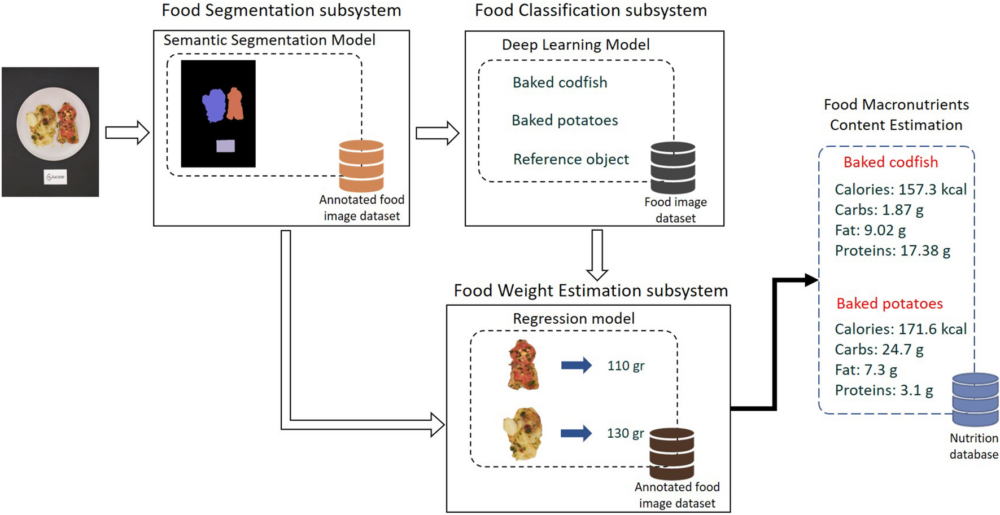

<em>Figura 2. Arquitectura usada para segmentar el plato, reconocer sus componentes y estimar su peso. Fuente: <a href="https://www.nature.com/articles/s41598-023-47885-0">artículo original</a>.</em>

Konstantakopoulos, Georga y Fotiadis estudiaron si el peso de un alimento podía estimarse con una sola foto tomada desde un teléfono. El modelo utiliza el área visible del alimento, el área de un objeto de referencia, la identidad del plato y su categoría. Con esos datos se probaron tres algoritmos de regresión: XGBoost, CatBoost y LightGBM [2].

El conjunto de trabajo reunió 23 052 imágenes anotadas de 226 platos mediterráneos y produjo 24 996 registros de entrenamiento. XGBoost obtuvo el mejor desempeño, con un error absoluto medio de 3,93 g, un error porcentual absoluto medio de 3,73 % y una raíz del error cuadrático medio de 6,05 g [2].

Este resultado muestra que la fotografía puede convertirse en una estimación expresada en gramos cuando el alimento está bien separado del fondo, correctamente clasificado y acompañado por una referencia de tamaño. No conviene trasladar esas métricas de manera automática a comidas peruanas: el modelo se entrenó con gastronomía mediterránea y bajo condiciones de captura definidas por el estudio.

### 1.3. *Applying Image-Based Food-Recognition Systems on Dietary Assessment: A Systematic Review*

  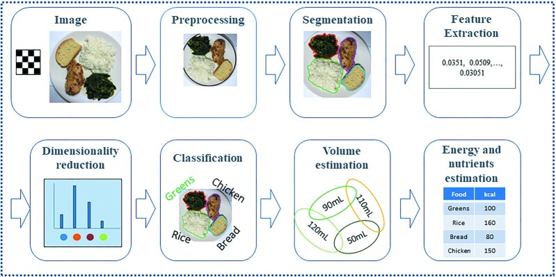

<em>Figura 3. Etapas habituales de un sistema de reconocimiento de alimentos y cálculo nutricional. Fuente: <a href="https://pmc.ncbi.nlm.nih.gov/articles/PMC9776640/">artículo original</a>.</em>

Dalakleidi et al. revisaron los sistemas que usan imágenes para apoyar la evaluación alimentaria. En conjunto, estos trabajos siguen una secuencia definida: captura de la fotografía, preprocesamiento, segmentación, extracción de características, clasificación del alimento, estimación del volumen y consulta de una base nutricional [3].

La revisión examinó 159 publicaciones y seleccionó 78. De ellas, 45 —el 58 %— recurrieron al aprendizaje profundo, sobre todo a redes neuronales convolucionales. Los autores también señalan la mejora alcanzada en el conjunto Food-101, donde la precisión de clasificación pasó de 55,3 % a 90,27 % con el desarrollo de estas técnicas [3].

El artículo ayuda a separar dos tareas que suelen confundirse. Reconocer arroz, pollo o verduras no equivale a saber cuánto hay de cada alimento. Si la segmentación o la porción se calcula mal, el valor de calorías y macronutrientes también será incorrecto, aun cuando el nombre del plato se haya identificado bien.

### Cuadro 1. Comparación de artículos científicos

| N.° | Recurso | Tema | Aporte | Variables o características | Valores o rangos |
|---:|---|---|---|---|---|
| 1 | Fang et al., *A Comparison of Food Portion Size Estimation Using Geometric Models and Depth Images* [1] | Estimación del volumen mediante geometría e imágenes de profundidad. | Explica cómo la forma y la profundidad influyen en el cálculo de una porción. | Volumen real y estimado, forma, mapa de profundidad, resolución y error. | 10 objetos; 50-450 mL; 640 × 480 px; sobreestimación en 9 de 10 objetos; relación estimado/real de 2,34 para el vaso. |
| 2 | Konstantakopoulos et al., *A Novel Approach to Estimate the Weight of Food Items Based on Features Extracted from an Image Using Boosting Algorithms* [2] | Estimación del peso a partir de una fotografía. | Relaciona características visuales y una referencia de escala con una medida en gramos. | Área del alimento, área de referencia, identidad, categoría, peso real y peso estimado. | 23 052 imágenes; 226 platos; 24 996 registros; XGBoost: MAE de 3,93 g, MAPE de 3,73 % y RMSE de 6,05 g. |
| 3 | Dalakleidi et al., *Applying Image-Based Food-Recognition Systems on Dietary Assessment: A Systematic Review* [3] | Reconocimiento de alimentos aplicado a la evaluación dietética. | Ordena el proceso completo e identifica los principales errores técnicos y de uso. | Segmentación, clasificación, volumen, energía, nutrientes, precisión y conjunto de datos. | 159 publicaciones examinadas; 78 incluidas; 45 estudios (58 %) con aprendizaje profundo; precisión en Food-101 de 55,3 % a 90,27 %. |

---

## 2. Patentes

### 2.1. *Food Recognition Using Visual Analysis and Speech Recognition* (US8439683B2)

  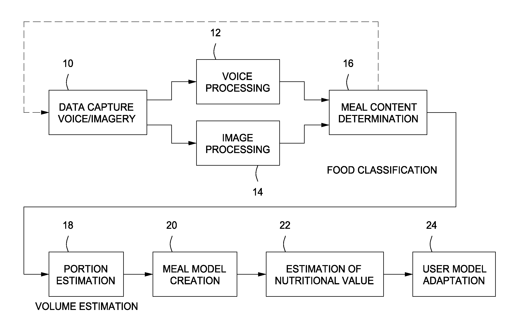

<em>Figura 4. Esquema general de captura, reconocimiento y estimación nutricional. Fuente: <a href="https://patents.google.com/patent/US8439683B2/en">patente US8439683B2</a>.</em>

Puri et al., inventores de una patente asignada a SRI International, plantearon un sistema que combina fotografías con una descripción oral o escrita de la comida [4]. La voz o el texto producen una lista inicial de alimentos; luego, el análisis de color y textura ayuda a clasificarlos y separarlos dentro de la imagen. Con varias vistas del plato, el sistema estima el volumen y lo relaciona con información nutricional.

La realización preferida requiere al menos tres imágenes de la misma escena. La patente menciona 400 conjuntos de imágenes de 150 tipos de alimentos y una evaluación independiente con 26 tipos. También propone consultar la base FNDDS, que contiene más de 7000 alimentos [4].

La combinación de voz e imagen puede reducir la ambigüedad ante preparaciones difíciles de distinguir visualmente. Como contrapartida, la interacción requiere que el usuario tome varias fotografías y añada una descripción. Esta exigencia deberá compararse con el tiempo y el esfuerzo que el público objetivo está dispuesto a dedicar al registro de una comida.

### 2.2. *Connected Food Scale System and Method* (US20140063180A1)

  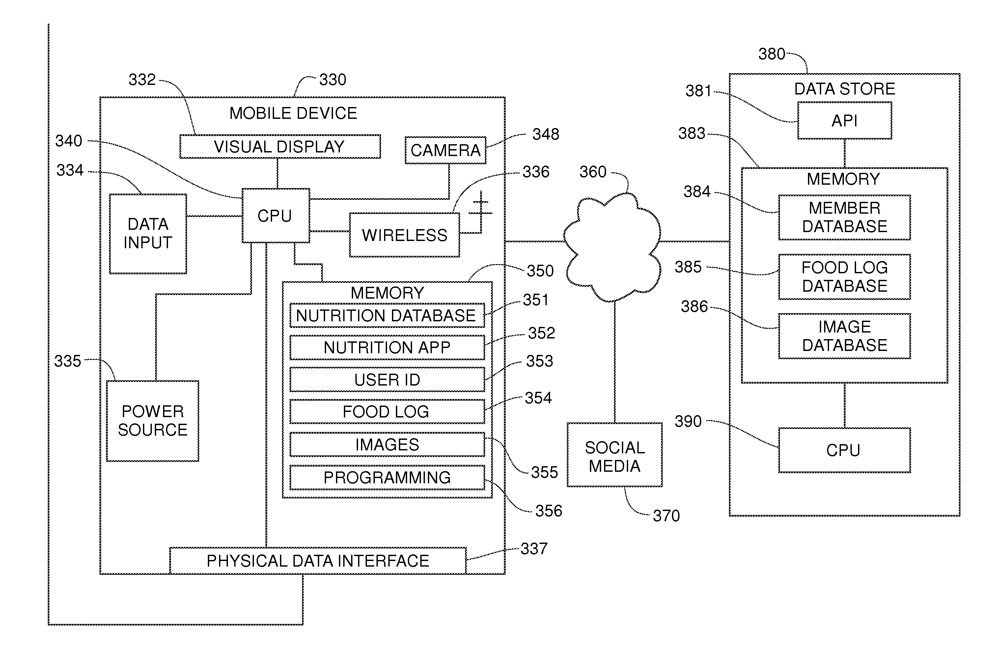

<em>Figura 5. Conexión entre el dispositivo móvil, el registro alimentario y la base de datos. Fuente: <a href="https://patents.google.com/patent/US20140063180/en">solicitud US20140063180A1</a>.</em>

Sharma describió una balanza digital conectada con uno o varios dispositivos móviles [5]. El diseño reúne un sensor de carga, conversión analógica-digital, memoria, pantalla y una interfaz de comunicación. Desde la aplicación se puede asociar el peso con el usuario, el alimento registrado y una fotografía.

La propuesta admite conexión física, Wi-Fi o Bluetooth y contempla historiales separados para seis a ocho personas. También incluye un soporte para colocar el teléfono y fotografiar el alimento mientras se encuentra sobre la balanza. La publicación no declara capacidad máxima ni precisión metrológica [5].

Su interés para el equipo se encuentra en la relación entre una medición física y el registro digital. El peso deja de ser una aproximación visual, aunque todavía es necesario identificar el alimento y seleccionar una entrada nutricional confiable. La solicitud figura como abandonada; se considera como antecedente de diseño y no como una patente vigente.

### 2.3. *一种自动识别食物卡路里的电子秤及方法* (CN108871530A)

  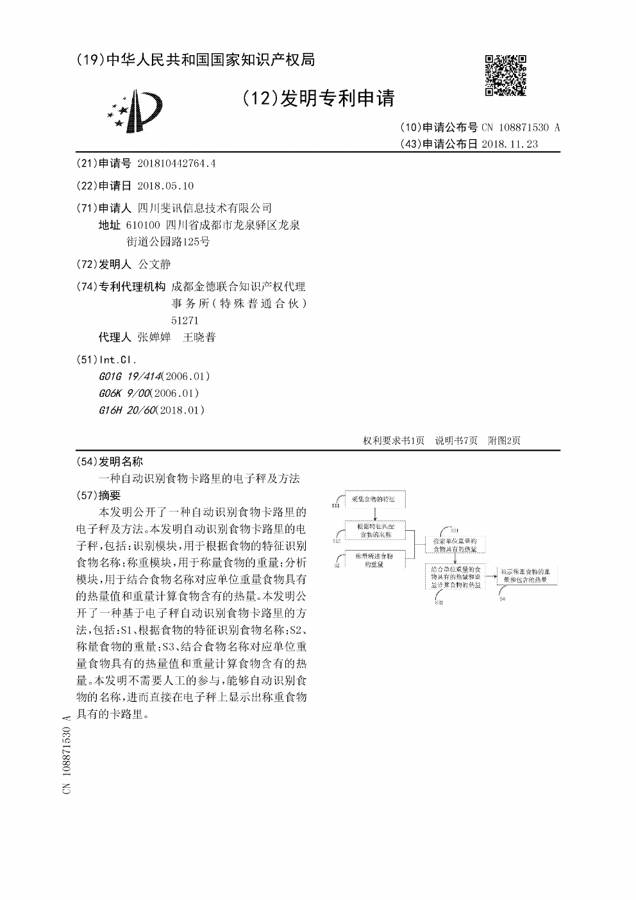

<em>Figura 6. Primera página y diagrama de funcionamiento de la solicitud. Fuente: <a href="https://patents.google.com/patent/CN108871530A/en">patente CN108871530A</a>.</em>

La solicitud presentada por 公文静 propone una balanza electrónica capaz de reconocer el alimento y mostrar sus calorías sin que la persona tenga que escribir el nombre [6]. Para ello reúne cinco componentes: identificación, pesaje, base de datos, análisis y visualización.

El cálculo toma el peso medido en gramos y el valor energético guardado para 100 g. La relación se expresa como `cal = m / 100 × C`. El documento incluye, a modo de ejemplo, arroz con 125 kcal/100 g, panecillo al vapor con 225 kcal/100 g y manzana con 60 kcal/100 g [6]. Estos números pertenecen al ejemplo de la patente y no forman una tabla nutricional adoptada por el equipo.

La propuesta integra las cuatro operaciones relacionadas con el proyecto: identificar, pesar, consultar y mostrar la información. Sin embargo, la publicación no informa la precisión del reconocimiento ni el rango o error de la balanza. La ficha de Google Patents registra la solicitud como pendiente.

### Cuadro 2. Comparación de patentes

| N.° | Recurso | Tema | Aporte | Variables o características | Valores o rangos |
|---:|---|---|---|---|---|
| 1 | *Food Recognition Using Visual Analysis and Speech Recognition*, US8439683B2 [4] | Reconocimiento mediante imágenes y una descripción oral o escrita. | Combina dos tipos de entrada para reducir dudas al identificar una comida. | Imagen, voz o texto, color, textura, clase, volumen y contenido calórico. | Al menos 3 imágenes; 400 conjuntos; 150 tipos de alimentos; evaluación con 26 tipos; FNDDS con más de 7000 alimentos. |
| 2 | *Connected Food Scale System and Method*, US20140063180A1 [5] | Balanza digital enlazada a una aplicación y a registros personales. | Une una medida directa del peso con fotografías, historial e información nutricional. | Peso, usuario, alimento, fotografía, memoria y conectividad. | Registros para 6-8 usuarios; conexión física, Wi-Fi o Bluetooth. Capacidad y precisión: no especificadas. |
| 3 | *一种自动识别食物卡路里的电子秤及方法*, CN108871530A [6] | Reconocimiento automático y cálculo de calorías desde una balanza. | Integra identificación, pesaje, consulta nutricional y visualización. | Características del alimento, nombre, peso en gramos y energía en kcal. | Fórmula `cal = m / 100 × C`; ejemplos: arroz 125 kcal/100 g, panecillo al vapor 225 kcal/100 g y manzana 60 kcal/100 g. Rango y precisión: no especificados. |

---

## 3. Tesis

### 3.1. *Single View Reconstruction for Food Portion Estimation*

  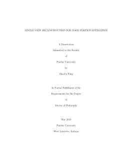

<em>Figura 7. Portada de la tesis doctoral de Shaobo Fang. Fuente: <a href="https://hammer.purdue.edu/articles/thesis/SINGLE_VIEW_RECONSTRUCTION_FOR_FOOD_PORTION_ESTIMATION/7767125/1">Purdue University</a>.</em>

La tesis doctoral de Fang estudia cómo estimar una porción usando una sola imagen, con la intención de evitar que el usuario tenga que fotografiar el plato desde varios ángulos [7]. El trabajo reúne tres líneas: reconstrucción con modelos geométricos y mapas de profundidad, uso de patrones de coocurrencia entre alimentos y estimación directa de energía mediante redes generativas adversarias.

En esta investigación, la porción puede expresarse como volumen, peso, energía o nutrientes. Uno de los métodos geométricos reporta un error inferior al 6 % al estimar la energía de una imagen, siempre que la segmentación y la identificación sean correctas [7]. La condición es importante: se evaluó una etapa del proceso y no un sistema completamente automático de principio a fin.

La tesis permite entender cómo se conectan la escala de la imagen, el volumen, el peso y las kilocalorías. También muestra que el contexto del plato puede mejorar una estimación. Para usar ese enfoque en el proyecto habría que comprobarlo con preparaciones y tamaños de porción cercanos a los del público estudiado.

### 3.2. *Modelo ProLab: Checkifood, aplicación móvil que ayuda al régimen alimenticio con machine learning*

  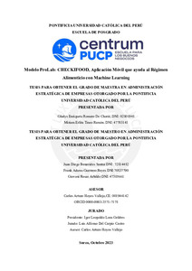

<em>Figura 8. Portada de la propuesta Checkifood. Fuente: <a href="http://hdl.handle.net/20.500.12404/28095">Repositorio de Tesis PUCP</a>.</em>

Romero De Chorié et al. desarrollaron una propuesta peruana dirigida a personas de 18 a 45 años interesadas en mejorar sus hábitos alimentarios [8]. Checkifood plantea reconocer y analizar platos a partir de fotografías mediante *machine learning*, reduciendo el ingreso manual que normalmente exigen las aplicaciones de seguimiento.

El documento se concentra en el modelo de negocio y en la experiencia prevista para el usuario, más que en la validación del algoritmo. Su valor como antecedente se encuentra en el contexto local y en la simplificación del registro de las comidas. La ficha pública no presenta datos sobre precisión de reconocimiento, error en gramos o exactitud del cálculo nutricional [8]; por esa razón, no se atribuye al sistema un desempeño técnico que la fuente no haya medido.

### 3.3. *Evaluación del aporte nutricional del menú del servicio de alimentación para deportistas albergados del IPD y su relación con sus requerimientos nutricionales*

  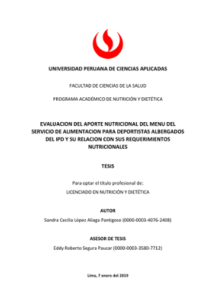

<em>Figura 9. Portada de la tesis de Sandra Cecilia López Aliaga Pantigoso. Fuente: <a href="http://hdl.handle.net/10757/625118">Repositorio Académico UPC</a>.</em>

López Aliaga Pantigoso analizó el menú y el consumo efectivo de deportistas de alto rendimiento alojados en la Villa Deportiva Nacional [9]. Durante una semana de agosto de 2018 se pesaron directamente el desayuno, el almuerzo, la cena y los fraccionamientos de 30 deportistas. Después se comparó lo consumido con sus requerimientos de energía y macronutrientes.

Aunque esta tesis no utiliza visión por computadora, aporta una referencia para validar mediciones: registra el peso servido, el peso consumido, la energía, las proteínas, los carbohidratos y las grasas. Este enfoque confirma que el análisis nutricional de una persona físicamente activa debe considerar la cantidad realmente consumida y no únicamente una porción estándar. La ficha pública consultada no expone todos los resultados individuales, por lo que el cuadro recoge solo los datos que pueden comprobarse [9].

### Cuadro 3. Comparación de tesis

| N.° | Recurso | Tema | Aporte | Variables o características | Valores o rangos |
|---:|---|---|---|---|---|
| 1 | Fang, *Single View Reconstruction for Food Portion Estimation* [7] | Estimación de porciones desde una sola imagen. | Relaciona la imagen con volumen, peso y energía, e incorpora contexto y aprendizaje profundo. | Forma, escala, volumen, peso, energía, segmentación y clase del alimento. | Error menor al 6 % en una estimación energética con modelos geométricos, suponiendo segmentación y clasificación correctas. |
| 2 | Romero De Chorié et al., *Modelo ProLab: Checkifood, aplicación móvil que ayuda al régimen alimenticio con machine learning* [8] | Registro y análisis de comidas mediante fotografías. | Presenta una propuesta local centrada en reducir la entrada manual. | Fotografía, plato detectado, hábitos, perfil y régimen alimentario. | Público objetivo de 18-45 años. La ficha pública no informa precisión ni error nutricional. |
| 3 | López Aliaga Pantigoso, *Evaluación del aporte nutricional del menú del servicio de alimentación para deportistas albergados del IPD y su relación con sus requerimientos nutricionales* [9] | Aporte nutricional y consumo efectivo de deportistas. | Define variables nutricionales y emplea el pesaje directo como referencia. | Peso servido y consumido, energía, proteínas, carbohidratos, grasas y requerimientos individuales. | 30 deportistas; 1 semana; 4 momentos de alimentación: desayuno, almuerzo, cena y fraccionamientos. |

---

## 4. Productos comerciales

### 4.1. *ESN00 Smart Nutrition Scale*

  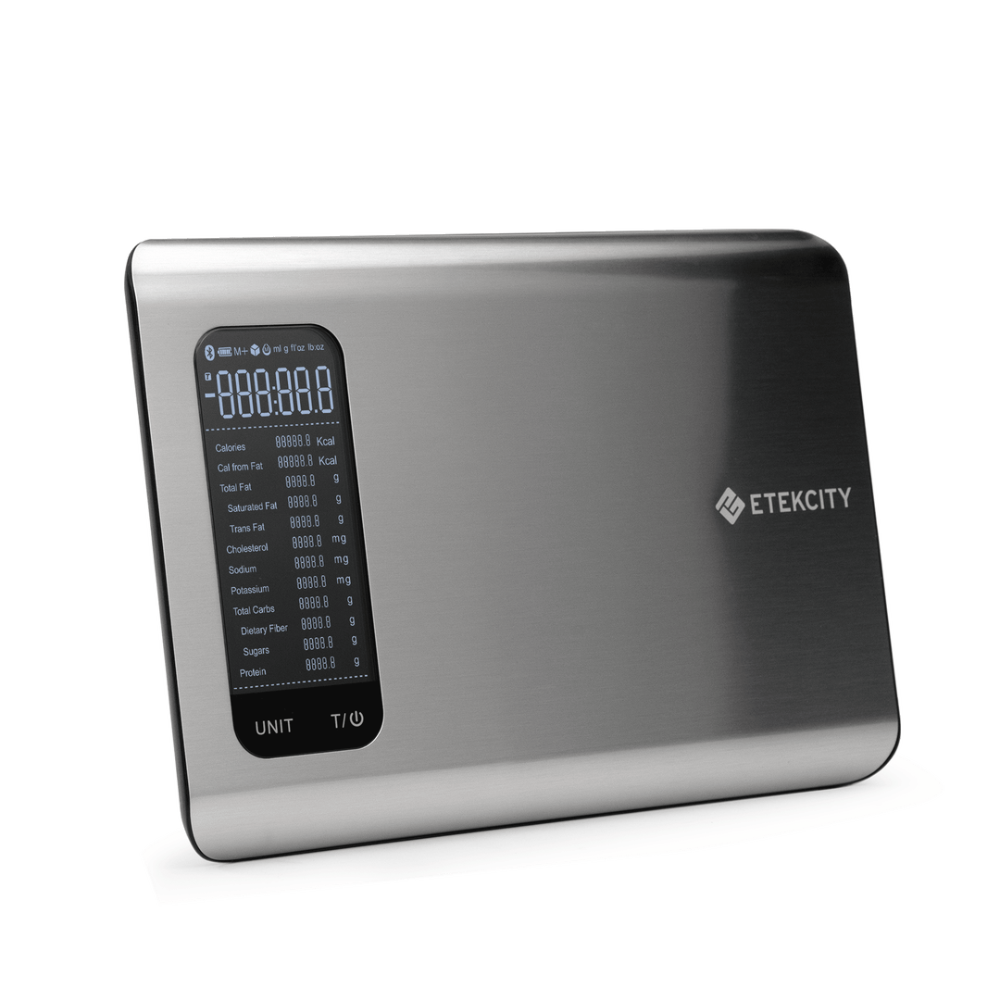

<em>Figura 10. Balanza nutricional inteligente Etekcity ESN00. Fuente: <a href="https://etekcity.com/products/smart-nutrition-scale-esn00">Etekcity</a>.</em>

La Etekcity ESN00 combina una balanza de cocina con la aplicación VeSync [10]. El usuario pesa el alimento y consulta hasta 19 nutrientes en una base de aproximadamente un millón de registros proporcionada por Nutritionix. El producto también ofrece tara, creación de alimentos personalizados y sincronización con Apple Health y Fitbit.

Sus cuatro sensores trabajan entre 3 y 5000 g, con incrementos de 1 g. La pantalla admite gramos, mililitros, onzas y libras/onzas [10]. Frente a una estimación realizada únicamente con la cámara, el pesaje proporciona una cantidad directa y verificable. Sin embargo, el usuario debe seleccionar el alimento correcto, ya que una medición precisa del peso no corrige una elección equivocada en la base de datos.

### 4.2. *Fitia - Contador de Calorías y Dietas con IA*

  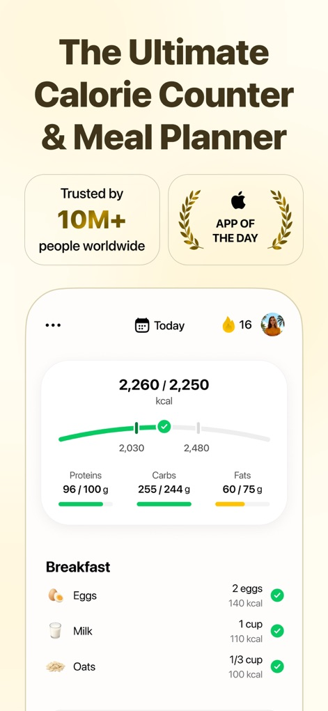

<em>Figura 11. Vista del registro diario de calorías y macronutrientes en Fitia. Fuente: <a href="https://apps.apple.com/app/fitia-diet-meal-planner/id1448277011">ficha de la aplicación</a>.</em>

Fitia permite registrar alimentos por fotografía, voz, texto o código de barras [11]. A partir del perfil y del objetivo de la persona, la aplicación organiza una meta de calorías y macronutrientes, muestra el avance diario y ofrece planes de comidas. La empresa indica que las entradas de su base pasan por un algoritmo interno y por revisión de profesionales en nutrición.

La posibilidad de elegir entre varios métodos de registro es especialmente relevante: no todas las comidas se describen con la misma facilidad y no todos los usuarios prefieren tomar una foto. La página explica que el escáner fotográfico estima calorías y macronutrientes y permite ajustar la porción, pero no publica una precisión en gramos ni un margen de error [11]. Por lo tanto, el producto sirve como referencia de interacción, no como prueba del rendimiento de esa función.

### 4.3. *SnapCalorie - AI Calorie Tracking Made Simple*

  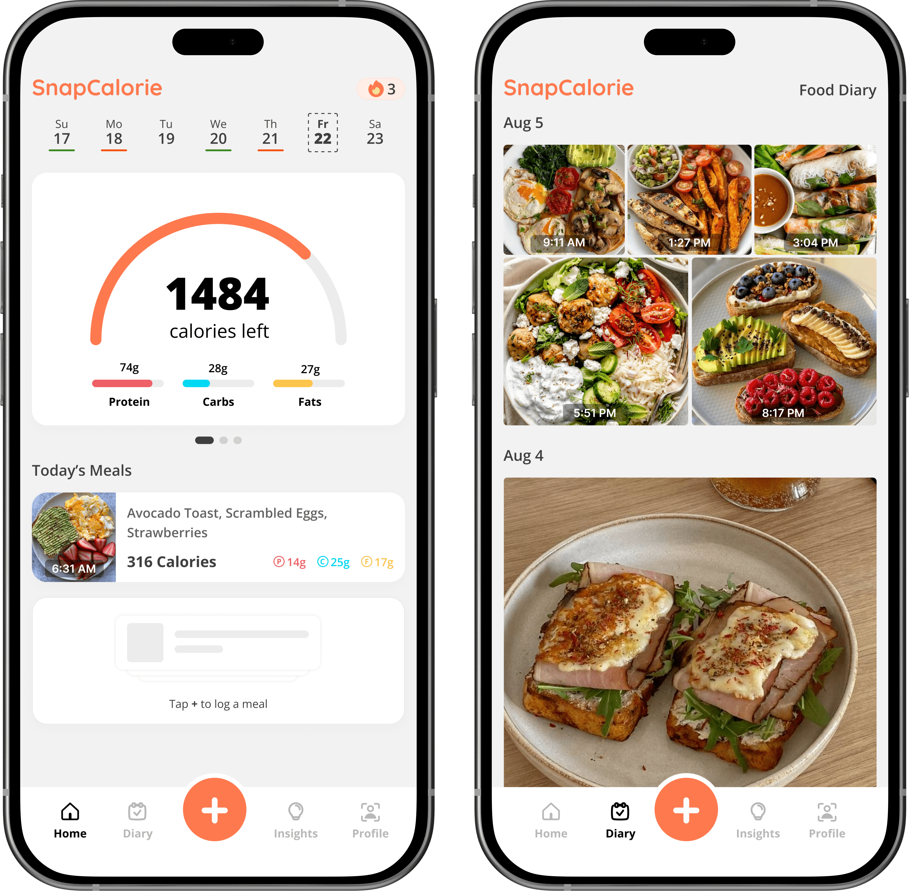

<em>Figura 12. Pantallas de seguimiento y diario fotográfico de SnapCalorie. Fuente: <a href="https://www.snapcalorie.com/">SnapCalorie</a>.</em>

SnapCalorie propone un registro breve: fotografiar la comida, dejar que el sistema identifique los alimentos y revisar el resultado antes de guardarlo [12]. La aplicación presenta calorías, proteínas, carbohidratos y grasas; además, incorpora notas de voz, tendencias y planificación de comidas.

En su página comercial se afirma que el registro es cinco veces más rápido que el ingreso manual y que la tecnología alcanza el doble de precisión que nutricionistas [12]. La página no publica la métrica, el tamaño de muestra ni el error absoluto detrás de esas comparaciones. Por ese motivo, las cifras se mantienen como declaraciones del fabricante y no como resultados comparables con los artículos científicos.

### Cuadro 4. Comparación de productos comerciales

| N.° | Recurso | Tema | Aporte | Variables o características | Valores o rangos |
|---:|---|---|---|---|---|
| 1 | Etekcity, *ESN00 Smart Nutrition Scale* [10] | Pesaje y consulta nutricional mediante una aplicación. | Ofrece una medida directa de la porción, tara y conexión con una base nutricional. | Peso, volumen equivalente para líquidos, alimento elegido y 19 nutrientes. | 3-5000 g; incremento de 1 g; 5000 mL; base de aproximadamente 1 millón de alimentos. |
| 2 | Fitia, *Contador de Calorías y Dietas con IA* [11] | Registro de alimentos y seguimiento de calorías y macronutrientes. | Reúne entradas por foto, voz, texto y código de barras en una experiencia sencilla. | Alimento, porción, calorías, proteínas, carbohidratos, grasas, actividad y objetivo. | Su página indica más de 150 estudios como base del algoritmo de necesidades; no publica precisión de la estimación fotográfica. |
| 3 | PerceptionLabs, *SnapCalorie - AI Calorie Tracking Made Simple* [12] | Registro nutricional a partir de una fotografía. | Reduce el flujo a captura, análisis, revisión y guardado. | Imagen, alimento, porción estimada, calorías y macronutrientes. | Declara 5× mayor rapidez y 2× la precisión de nutricionistas, sin publicar metodología ni error absoluto en la página del producto. |

---

## 5. Síntesis de hallazgos

**Diferencia entre reconocimiento y estimación de la porción.** Los artículos y las patentes separan la clasificación del cálculo de la cantidad. Un sistema puede reconocer correctamente un alimento y, al mismo tiempo, estimar de manera incorrecta su peso. Este error se traslada directamente al cálculo de energía y nutrientes.

**Necesidad de referencias para la estimación visual.** La escala, la forma tridimensional, el ángulo y la superposición entre alimentos modifican la medida. Los resultados más precisos se obtuvieron con segmentaciones correctas, objetos de referencia o condiciones controladas. Estas condiciones deberán considerarse en las pruebas que realice el equipo.

**Uso del pesaje como punto de comparación.** Tanto las patentes como la balanza comercial muestran que la medición del peso es más directa que su estimación a partir de una imagen. El pesaje no resuelve por completo el proceso, pues todavía se debe identificar el alimento y utilizar una composición nutricional adecuada. No obstante, proporciona un valor con el cual comprobar la estimación visual.

**Importancia de la rapidez y la facilidad de registro.** Fitia, SnapCalorie y Checkifood reducen el ingreso manual mediante fotografías, voz y escaneo. Esta facilidad puede favorecer el uso cotidiano. Para evaluar una propuesta no será suficiente contar los pasos; también deberán medirse el tiempo requerido, la cantidad de correcciones y la confiabilidad del resultado final.

**Trazabilidad de la información nutricional.** El usuario deberá distinguir el peso medido del peso estimado y conocer la base utilizada para calcular calorías, proteínas, carbohidratos y grasas. La presentación de las unidades y la posibilidad de corregir el alimento o la porción evitarán que una aproximación sea interpretada como un dato exacto.

---

## 6. Conclusiones

1. Las imágenes pueden emplearse para estimar peso, volumen o energía, pero el resultado depende de la captura, la segmentación, la clasificación y la referencia de escala. Una cifra obtenida en condiciones controladas no puede asumirse igual para cualquier plato.

2. Los antecedentes técnicos siguen tres caminos que pueden complementarse: análisis visual, apoyo de voz o texto y pesaje directo. Cada uno resuelve una parte diferente del problema y también exige un nivel distinto de participación del usuario.

3. Las tesis añaden dos elementos que la revisión internacional no cubre por completo: un antecedente de uso pensado para el contexto peruano y la necesidad de comparar los nutrientes con la cantidad realmente consumida por personas físicamente activas.

4. Los productos comerciales muestran interfaces rápidas y fáciles de entender, aunque sus páginas no siempre publican métricas suficientes para juzgar la precisión. En las siguientes etapas convendrá evaluar por separado exactitud, tiempo de registro, facilidad de corrección y claridad de la información.

---

## 7. Referencias

1. Fang S, Zhu F, Jiang C, Zhang S, Boushey CJ, Delp EJ. [*A Comparison of Food Portion Size Estimation Using Geometric Models and Depth Images*](https://pmc.ncbi.nlm.nih.gov/articles/PMC6226035/). En: *2016 IEEE International Conference on Image Processing (ICIP)*. IEEE; 2016. p. 26-30. doi: [10.1109/ICIP.2016.7532312](https://doi.org/10.1109/ICIP.2016.7532312).

2. Konstantakopoulos FS, Georga EI, Fotiadis DI. [*A Novel Approach to Estimate the Weight of Food Items Based on Features Extracted from an Image Using Boosting Algorithms*](https://www.nature.com/articles/s41598-023-47885-0). *Scientific Reports*. 2023;13:21040. doi: [10.1038/s41598-023-47885-0](https://doi.org/10.1038/s41598-023-47885-0).

3. Dalakleidi KV, Papadelli M, Kapolos I, Papadimitriou K. [*Applying Image-Based Food-Recognition Systems on Dietary Assessment: A Systematic Review*](https://pmc.ncbi.nlm.nih.gov/articles/PMC9776640/). *Advances in Nutrition*. 2022;13(6):2590-2619. doi: [10.1093/advances/nmac078](https://doi.org/10.1093/advances/nmac078).

4. Puri M, Zhu Z, Lubin J, Pschar T, Divakaran A, Sawhney HS. [*Food Recognition Using Visual Analysis and Speech Recognition*](https://patents.google.com/patent/US8439683B2/en). Patente estadounidense US8439683B2. SRI International Inc.; 14 de mayo de 2013.

5. Sharma A. [*Connected Food Scale System and Method*](https://patents.google.com/patent/US20140063180/en). Solicitud de patente estadounidense US20140063180A1. BBY Solutions Inc.; 6 de marzo de 2014.

6. 公文静. [*一种自动识别食物卡路里的电子秤及方法*](https://patents.google.com/patent/CN108871530A/en). Solicitud de patente china CN108871530A. Sichuan Feixun Information Technology Co. Ltd.; 23 de noviembre de 2018.

7. Fang S. [*Single View Reconstruction for Food Portion Estimation*](https://hammer.purdue.edu/articles/thesis/SINGLE_VIEW_RECONSTRUCTION_FOR_FOOD_PORTION_ESTIMATION/7767125/1) [tesis doctoral]. West Lafayette: Purdue University; 2019. doi: [10.25394/PGS.7767125.v1](https://doi.org/10.25394/PGS.7767125.v1).

8. Romero De Chorié GE, Tineo Ramón ME, Benavides Santur JD, Guerrero Reyes FA, Rosas Arbildo G. [*Modelo ProLab: Checkifood, aplicación móvil que ayuda al régimen alimenticio con machine learning*](http://hdl.handle.net/20.500.12404/28095) [tesis de maestría]. Lima: Pontificia Universidad Católica del Perú; 2024.

9. López Aliaga Pantigoso SC. [*Evaluación del aporte nutricional del menú del servicio de alimentación para deportistas albergados del IPD y su relación con sus requerimientos nutricionales*](http://hdl.handle.net/10757/625118) [tesis de licenciatura]. Lima: Universidad Peruana de Ciencias Aplicadas; 2019.

10. Etekcity. [*ESN00 Smart Nutrition Scale*](https://etekcity.com/products/smart-nutrition-scale-esn00) [Internet]. Consultado el 3 de septiembre de 2026.

11. Fitia. [*Contador de Calorías y Dietas con IA*](https://fitia.app/es/) [Internet]. Consultado el 3 de septiembre de 2026.

12. PerceptionLabs Inc. [*SnapCalorie - AI Calorie Tracking Made Simple*](https://www.snapcalorie.com/) [Internet]. Consultado el 3 de septiembre de 2026.
