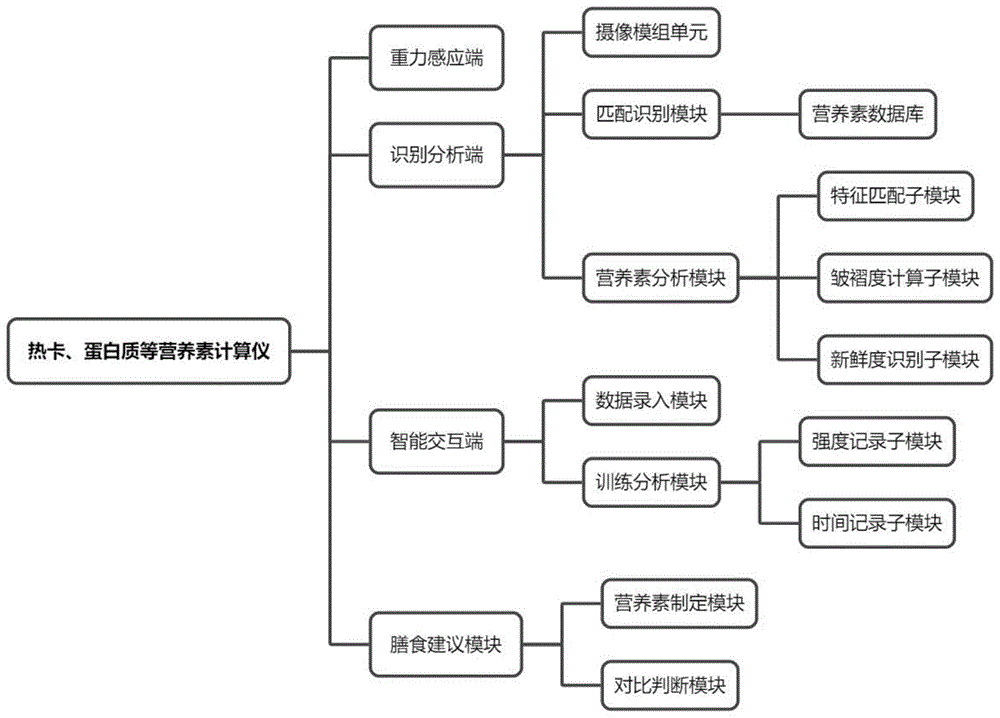
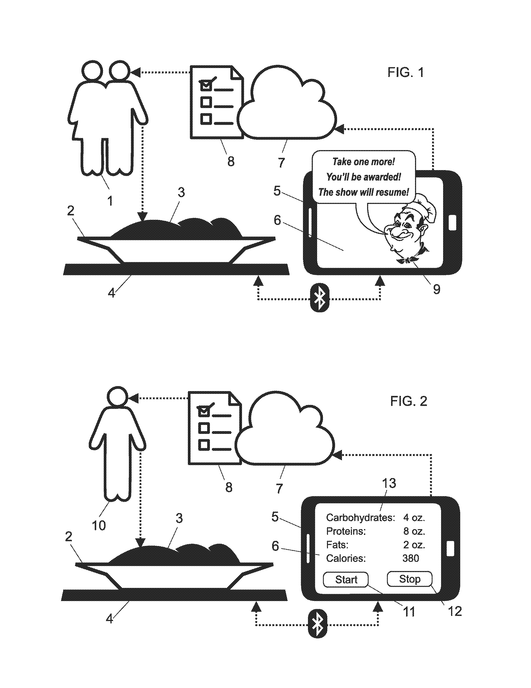
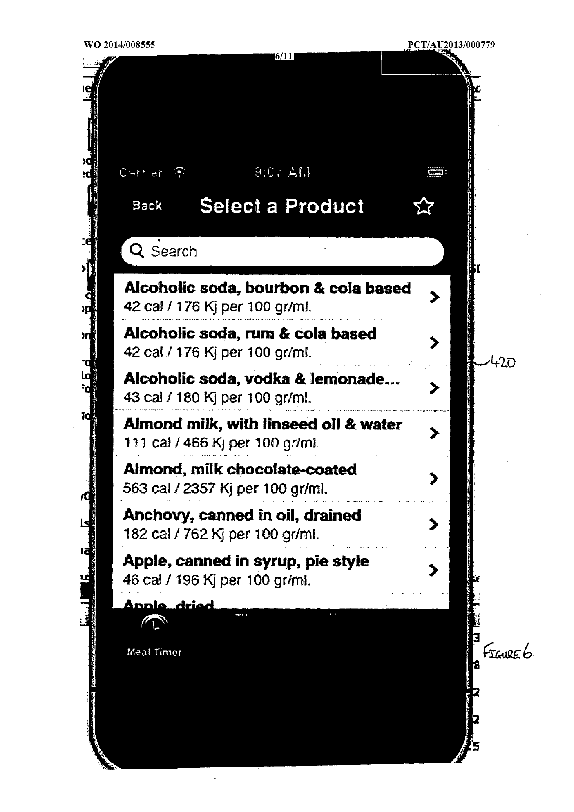

# Taller 04 - Patentes

## 1. Calculador de calorías, proteínas y otros nutrientes (CN114360689A)

| Dato | Información |
|---|---|
| **Título original** | *热卡、蛋白质等营养素计算仪* |
| **Título en español** | Calculador de calorías, proteínas y otros nutrientes |
| **Número de publicación** | CN114360689A |
| **Fecha de publicación** | 15 de abril de 2022 |
| **Inventora** | Wan Jingwen (万景雯) |
| **Solicitante** | Hospital Popular Afiliado a la Universidad de Ningbo |
| **Tipo de documento** | Solicitud de patente de invención china |

  

<em>Figura 1. Arquitectura del calculador: pesaje, reconocimiento y análisis, interacción y recomendación alimentaria. Fuente: documento de patente CN114360689A [1].</em>

### Resumen

La patente describe un instrumento que pesa el alimento y calcula su composición nutricional. El sistema integra un extremo de detección por gravedad, una cámara, un módulo de reconocimiento, una base de datos nutricional, un módulo de análisis y una interfaz para el usuario. El alimento puede identificarse mediante una fotografía o por el ingreso de su nombre. Una vez identificado, el sistema combina su peso, sus parámetros nutricionales y una estimación de frescura para calcular los nutrientes de la porción real [1].

La propuesta también registra altura, peso, condición de salud, resultados de laboratorio y datos de entrenamiento. Con esa información compara los nutrientes del alimento con una ingesta de referencia y genera sugerencias alimentarias. La patente presenta esta última función para pacientes; por ello, no debe trasladarse al proyecto como diagnóstico o recomendación médica sin validación profesional.

### Campo de aplicación

Se ubica en el campo del pesaje de alimentos y del procesamiento de información nutricional. Sus aplicaciones comprenden el cálculo de calorías y macronutrientes, el reconocimiento de alimentos por imagen, la evaluación de frescura y el apoyo al seguimiento alimentario de pacientes o personas físicamente activas.

### ¿Qué aporta al proyecto?

Su principal aporte es una arquitectura que conecta cuatro operaciones necesarias para el sistema de información nutricional de porciones: **medir la masa, identificar el alimento, consultar una base nutricional y calcular los valores correspondientes a la cantidad real**. También propone una entrada alternativa por nombre cuando la cámara no identifica correctamente el alimento. Para el proyecto conviene conservar esa posibilidad de corrección, mostrar la fuente de los datos y distinguir claramente el peso medido de los valores estimados. El análisis de frescura puede considerarse una ampliación futura, pero no es indispensable para el primer prototipo.

### Variables, características y valores o rangos

| Elemento | Variable o característica | Valor, rango o relación indicada |
|---|---|---|
| Porción | Masa del alimento | `G`; obtenida mediante el sensor de gravedad. La patente no declara capacidad, resolución ni error de pesaje. |
| Cálculo nutricional | Nutriente calculado | `Y = α × G × β × P`, donde `α` relaciona el nutriente con la masa, `P` representa la frescura y `β` relaciona el nutriente con la frescura. |
| Frescura | Longitud y densidad de arrugas | Variables `H` y `B`; ambas se consideran inversamente relacionadas con la frescura. El parámetro `γ` es mayor que cero. |
| Identificación | Entrada del alimento | Fotografía mediante cámara o ingreso manual del nombre. No se informa exactitud de reconocimiento. |
| Actividad física | Intensidad y duración | Se acumulan en ciclos diarios para estimar el volumen de entrenamiento. No se fijan rangos numéricos. |
| Perfil | Datos personales | Altura, peso, condición de salud y resultados de laboratorio. |
| Salida | Información calculada | Calorías, proteínas y otros nutrientes, además de una comparación con valores de referencia. |

---

## 2. Métodos, sistema y aparato para mejorar la motivación y el control durante las comidas y automatizar el seguimiento nutricional (US10292511B2)

| Dato | Información |
|---|---|
| **Título original** | *Methods, System and Apparatus to Improve Motivation and Control When Taking Meals and to Automate the Process of Monitoring Nutrition* |
| **Título en español** | Métodos, sistema y aparato para mejorar la motivación y el control durante las comidas y automatizar el seguimiento nutricional |
| **Número de publicación** | US10292511B2 |
| **Fecha de publicación** | 21 de mayo de 2019 |
| **Inventor** | Anatoliy Tkach |
| **Tipo de documento** | Patente estadounidense concedida |

  

<em>Figura 2. Flujos propuestos para niños y adultos: plato sobre una balanza, conexión Bluetooth, aplicación móvil y almacenamiento en la nube. Fuente: patente US10292511B2 [2].</em>

### Resumen

La patente presenta una balanza electrónica plana que funciona como base para un plato, una taza o un vaso. La balanza se comunica mediante Bluetooth u otra conexión inalámbrica con una aplicación móvil, y la aplicación envía los registros a un servicio en la nube. Primero se pesa el plato vacío; después se coloca la comida y el sistema obtiene la masa inicial por diferencia. Durante la comida se realizan lecturas sucesivas para conocer cuánto se ha consumido [2].

En el modo para niños, la aplicación muestra contenido audiovisual y lo pausa cuando no detecta una reducción suficiente del peso durante un periodo establecido. En el modo para adultos, el usuario inicia y termina la sesión; la aplicación registra la cantidad consumida y recupera la información de nutrientes y calorías asociada al alimento. El historial queda disponible para el usuario o para sus responsables.

### Campo de aplicación

Corresponde al equipamiento para servir y pesar comidas, la comunicación inalámbrica entre sensores y dispositivos móviles, el seguimiento del consumo alimentario y el registro nutricional. Incluye un uso específico de motivación durante la alimentación infantil y otro de control nutricional para adultos.

### ¿Qué aporta al proyecto?

Esta patente introduce una diferencia importante entre **cantidad servida** y **cantidad realmente consumida**. Para el proyecto, una balanza de perfil bajo puede medir de forma continua sin obligar al usuario a retirar el plato. El procedimiento de registrar primero el recipiente vacío equivale a una tara guiada y reduce errores. La conexión con una aplicación permite guardar fecha, alimento, peso, calorías y macronutrientes. El componente de entretenimiento infantil no corresponde al público inicial del proyecto, pero los umbrales configurables y las alertas sí sirven como referencia para diseñar el control del proceso.

### Variables, características y valores o rangos

| Elemento | Variable o característica | Valor, rango o relación indicada |
|---|---|---|
| Medición | Intervalo entre lecturas | Ejemplo de una lectura cada **2 segundos**; el valor puede configurarse. |
| Detección de consumo | Cambio de masa | Ejemplo de una reducción superior a **20 g** para validar que se ha consumido una porción; el umbral puede configurarse. |
| Pausa o aviso | Tiempo sin una reducción válida | Ejemplo de **30 segundos**; el tiempo puede configurarse. |
| Fin de sesión infantil | Proporción consumida | Ejemplo de **75 %** de la comida; el objetivo puede configurarse. |
| Público infantil descrito | Edad | Niños preescolares y escolares de hasta **8 años**. |
| Conectividad | Balanza-aplicación | Bluetooth u otra conexión inalámbrica. |
| Salidas | Datos mostrados o almacenados | Masa consumida, descripción de la comida, nutrientes y calorías; historial en la nube. |
| Metrología | Capacidad y precisión de la balanza | No especificadas en el documento. |

---

## 3. Método y sistema para planificar y supervisar el consumo de calorías (WO2014008555A1)

| Dato | Información |
|---|---|
| **Título original** | *Method and System for Planning and Monitoring Calorie Consumption* |
| **Título en español** | Método y sistema para planificar y supervisar el consumo de calorías |
| **Número de publicación** | WO2014008555A1 |
| **Fecha de publicación** | 16 de enero de 2014 |
| **Inventor** | George Kourtesis |
| **Solicitud internacional** | PCT/AU2013/000779 |
| **Tipo de documento** | Solicitud internacional PCT |

  

<em>Figura 3. Interfaz de selección de productos con energía expresada por 100 g o 100 mL. Fuente: documento de patente WO2014008555A1, figura 6 [3].</em>

### Resumen

La patente propone un sistema para calcular la ingesta calórica diaria de una persona, registrar comidas y actividades, y estimar cuánto tiempo debe transcurrir antes de la siguiente comida. Utiliza datos demográficos —sexo, edad, peso y altura—, nivel de actividad, una base de datos de alimentos y, en algunas realizaciones, mediciones de un monitor de frecuencia cardiaca. También puede considerar ritmos diferentes de gasto energético durante el sueño, la vigilia y el ejercicio [3].

Cada alimento se registra mediante su energía por gramo o mediante la suma de los ingredientes de una preparación. El sistema puede calcular las calorías de una porción conocida o realizar la operación inversa: determinar cuántos gramos se necesitan para alcanzar una cantidad de calorías elegida. Asimismo, admite planificación de comidas, lectura de códigos de barras, avisos y gráficos históricos.

### Campo de aplicación

Pertenece al campo de los sistemas informáticos de planificación alimentaria, seguimiento de calorías, cálculo del tamaño de porciones e integración de datos de actividad física. Puede implementarse como software para computadora, aplicación móvil o servicio web.

### ¿Qué aporta al proyecto?

Su aporte principal es el **escalamiento entre una referencia nutricional y la porción real**. El proyecto puede almacenar calorías, proteínas, carbohidratos y grasas por 100 g, convertirlos a valores por gramo y multiplicarlos por la masa medida. La patente también muestra cómo organizar una interfaz de búsqueda y cómo mantener un historial. En cambio, el cálculo del momento de la siguiente comida y las recomendaciones personalizadas exceden el alcance inicial; pueden estudiarse después, siempre que no se presenten como prescripción médica.

### Variables, características y valores o rangos

| Elemento | Variable o característica | Valor, rango o relación indicada |
|---|---|---|
| Tasa calórica | Relación tiempo-calorías (`TVC`) | `TVC = ingesta diaria recomendada / 1 440`, porque un día tiene **1 440 minutos**. |
| Tiempo entre comidas | `TimeCal` | `TimeCal = calorías de la comida / TVC`; el resultado se expresa en minutos. |
| Base de alimentos | Densidad energética | Calorías por gramo; también contempla un conversor de valores por **100 g a 1 g**. La interfaz ilustrada muestra valores por **100 g o 100 mL**. |
| Composición nutricional | Nutrientes registrados | Calorías, proteínas, carbohidratos, grasas y fibra. |
| Perfil | Datos demográficos y actividad | Sexo, edad, peso, altura y nivel de ejercicio. |
| Modelo de referencia descrito | Peso corporal | La tabla usada en una realización llega hasta **90 kg**; para masas mayores propone extrapolar mediante calorías por kilogramo. Este procedimiento es un antecedente, no una recomendación vigente. |
| Calibración de actividad | Periodo de uso del monitor | Al menos **24 horas**; una variante preferida usa **7 días** para promediar la rutina semanal. |
| Historial | Periodo de visualización | Gráficos de peso, calorías, carbohidratos, proteínas y medidas corporales por hasta **3 años**. |

---

## Comparación de las tres patentes

| Patente | Función principal | Aporte más útil para el proyecto | Limitación o aspecto que requiere validación |
|---|---|---|---|
| **CN114360689A** | Pesa, reconoce y calcula nutrientes; además estima frescura. | Integra sensor de masa, cámara, base nutricional e interfaz en un solo flujo. | No publica capacidad, error de pesaje ni exactitud del reconocimiento. |
| **US10292511B2** | Registra continuamente la masa consumida mediante una balanza conectada. | Distingue la porción servida de la realmente consumida y permite conservar un historial. | No especifica capacidad, resolución o precisión metrológica de la balanza. |
| **WO2014008555A1** | Calcula porciones y planifica el consumo a partir de datos nutricionales y actividad. | Define el escalamiento por gramo, el cálculo inverso de porciones y la organización del historial. | Sus modelos de recomendación deben actualizarse y validarse antes de utilizarlos con usuarios. |

## Conclusión

Las tres patentes son complementarias. CN114360689A aporta la arquitectura completa para identificar, pesar y calcular; US10292511B2 aporta el seguimiento de la cantidad realmente consumida; y WO2014008555A1 aporta las operaciones para escalar nutrientes según la masa y organizar la información. A partir de estos antecedentes, el primer prototipo debería priorizar una medición confiable de la porción, una identificación corregible del alimento, el cálculo de calorías y macronutrientes con una fuente declarada y un historial sencillo. Las recomendaciones clínicas, la frescura y la planificación personalizada pueden quedar fuera del alcance inicial hasta contar con validación suficiente.

## Referencias

1. Wan J. [*Calculating Instrument for Nutrients such as Calorie and Protein* (CN114360689A)](https://worldwide.espacenet.com/patent/search/family/081108513/publication/CN114360689A?q=pn%3DCN114360689A). Solicitud de patente china. Publicada el 15 de abril de 2022. [Texto y figuras en Google Patents](https://patents.google.com/patent/CN114360689A/en).

2. Tkach A. [*Methods, System and Apparatus to Improve Motivation and Control When Taking Meals and to Automate the Process of Monitoring Nutrition* (US10292511B2)](https://worldwide.espacenet.com/patent/search/family/061829498/publication/US10292511B2?q=pn%3DUS10292511B2). Patente estadounidense. Publicada el 21 de mayo de 2019. [Texto y figuras en Google Patents](https://patents.google.com/patent/US10292511B2/en).

3. Kourtesis G. [*Method and System for Planning and Monitoring Calorie Consumption* (WO2014008555A1)](https://worldwide.espacenet.com/patent/search/family/049915262/publication/WO2014008555A1?q=pn%3DWO2014008555A1). Solicitud internacional PCT. Publicada el 16 de enero de 2014. [Texto y figuras en Google Patents](https://patents.google.com/patent/WO2014008555A1/en).
