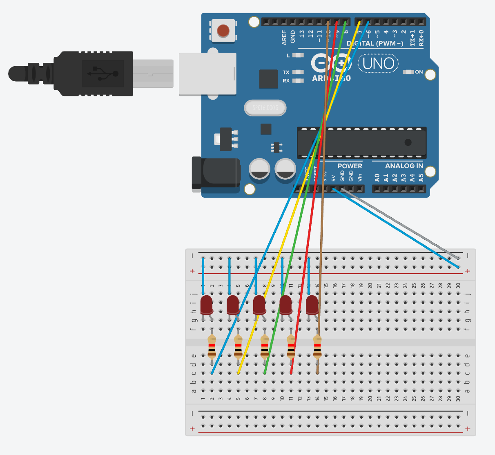
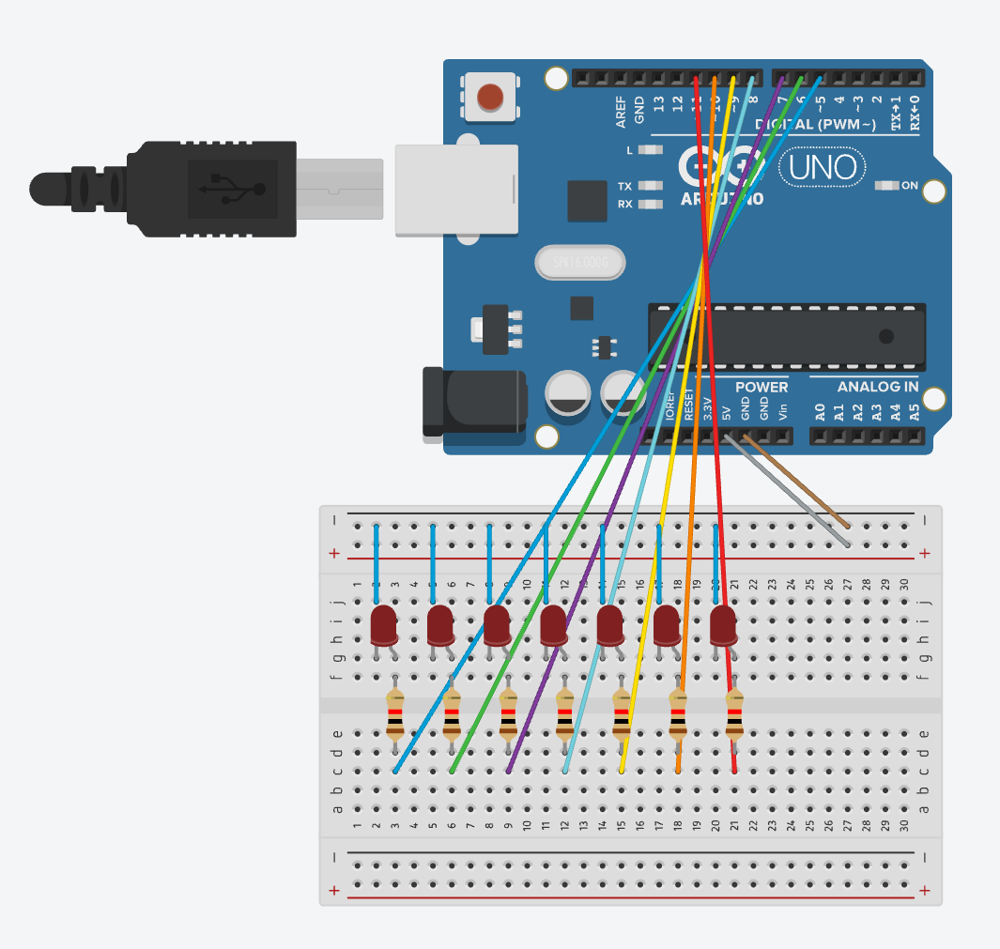

# Taller 6 - Reto 3

## Circuito 1: secuencia de 5 LED

<p align="center">
  
</p>

[Abrir simulación en Tinkercad](https://www.tinkercad.com/things/hH3RxuDeKxx/editel?sharecode=I47mTb67qEQSkHlg2kYVo2O135K7y9fr5DEhy1pAJCg)

Los LED conectados a los pines 6 al 10 se encienden y apagan en secuencia cada 500 ms.

### Código Arduino

```cpp
void setup() {
  // Inicializamos los pines como salidas.
  pinMode(6, OUTPUT);
  pinMode(7, OUTPUT);
  pinMode(8, OUTPUT);
  pinMode(9, OUTPUT);
  pinMode(10, OUTPUT);
}

void loop() {
  digitalWrite(6, HIGH);
  delay(500);
  digitalWrite(6, LOW);
  delay(500);

  digitalWrite(7, HIGH);
  delay(500);
  digitalWrite(7, LOW);
  delay(500);

  digitalWrite(8, HIGH);
  delay(500);
  digitalWrite(8, LOW);
  delay(500);

  digitalWrite(9, HIGH);
  delay(500);
  digitalWrite(9, LOW);
  delay(500);

  digitalWrite(10, HIGH);
  delay(500);
  digitalWrite(10, LOW);
  delay(500);
}
```

## Circuito 2: secuencia bidireccional de 7 LED

<p align="center">
  
</p>

[Abrir simulación en Tinkercad](https://www.tinkercad.com/things/aJXTgZu1wz6-smashing-lahdi/editel?returnTo=https://www.tinkercad.com/things/hH3RxuDeKxx-mighty-inari&sharecode=DPw9luLrICN49RkAil0n4do0jmM7E3_l6L_tAg67I8c)

Los LED conectados a los pines 5 al 11 se encienden en orden ascendente y luego descendente cada 50 ms.

### Código Arduino

```cpp
int pinLEDs[7] = {5, 6, 7, 8, 9, 10, 11}; // Pines de cada LED.
int i = 0;

void setup() {
  for (i = 0; i < 7; i++) {
    pinMode(pinLEDs[i], OUTPUT);
  }
}

void loop() {
  for (i = 0; i < 7; i++) {
    digitalWrite(pinLEDs[i], HIGH);
    delay(50);
    digitalWrite(pinLEDs[i], LOW);
    delay(50);
  }

  for (i = 6; i >= 0; i--) {
    digitalWrite(pinLEDs[i], HIGH);
    delay(50);
    digitalWrite(pinLEDs[i], LOW);
    delay(50);
  }
}
```
