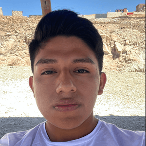

  

<h1 align="center">Equipo 10 — Fundamentos de Diseño</h1>

  <strong>Ingeniería Informática e Ingeniería Industrial · 2026-2</strong> 
  Universidad Peruana Cayetano Heredia

---

## 🌍 Descripción del Equipo
Somos el **Equipo 10** del curso **Fundamentos de Diseño 2026-2**, conformado por estudiantes de las carreras de Ingeniería Informática e Industrial.
Nuestro objetivo es aplicar la metodología de diseño para generar soluciones innovadoras con impacto social, tecnológico y ambiental.

---

## 🎯 ODS principal: ODS 12 — Producción y consumo responsables

  

El Objetivo de Desarrollo Sostenible 12 busca garantizar modalidades de consumo y producción sostenibles. Este objetivo promueve el uso responsable de los recursos, la reducción de residuos y el acceso a información que permita a las personas adoptar decisiones de consumo más conscientes.

### Meta seleccionada: 12.8

La meta 12.8 busca garantizar que, para el año 2030, las personas dispongan de información y conocimientos relevantes que les permitan adoptar estilos de vida sostenibles y en armonía con la naturaleza.

---

## ⚠️ Problemática identificada

En la vida cotidiana, las personas que desean controlar y conocer mejor su alimentación presentan dificultades para obtener información práctica, inmediata y comprensible sobre la cantidad y la composición nutricional de los alimentos que consumen.

Aunque existen tablas nutricionales, aplicaciones y bases de datos, estas herramientas suelen presentar valores correspondientes a cantidades estandarizadas, como 100 gramos o porciones predeterminadas. Por ello, el usuario debe identificar el alimento, estimar la cantidad servida, consultar distintas referencias e introducir manualmente los datos. Este proceso requiere tiempo y conocimientos previos, puede producir estimaciones poco consistentes y dificulta mantener un seguimiento frecuente.

Esta situación resulta especialmente relevante para las personas que realizan actividad física y buscan conocer regularmente la composición de sus comidas, principalmente la cantidad de proteínas, carbohidratos y grasas presentes en las porciones que consumen.

Por lo tanto, el problema no es necesariamente la ausencia de información nutricional, sino la dificultad para relacionar la información general disponible con la cantidad real de alimento presente en una porción cotidiana. Esta limitación puede reducir la capacidad de las personas para comparar sus porciones y tomar decisiones informadas y conscientes sobre su consumo.

---

## 👥 Público objetivo

### Público general

Personas interesadas en conocer mejor las cantidades y la composición nutricional de los alimentos que consumen.

### Público inicial

Personas físicamente activas que realizan un seguimiento frecuente de su alimentación y necesitan consultar información sobre las porciones y los macronutrientes presentes en sus comidas.

---

## 🔗 Relación de la problemática con el ODS 12

La problemática se relaciona con el ODS 12 porque el acceso a información comprensible sobre los alimentos y sus porciones puede favorecer decisiones de consumo más informadas y conscientes.

En particular, se vincula con la meta 12.8, ya que esta plantea la necesidad de que las personas dispongan de información y conocimientos relevantes para adoptar hábitos de consumo responsables. El equipo se enfocará inicialmente en comprender las dificultades que encuentran los usuarios al intentar obtener y utilizar esta información, antes de definir una solución o prototipo.

Para precisar su vínculo con el consumo sostenible, el equipo analizará también si las dificultades para comprender y estimar las porciones influyen en la planificación de las cantidades consumidas y en decisiones que puedan producir consumo excesivo o desperdicio de alimentos. Esta relación se estudiará como parte de la problemática y no se asumirá como un resultado previo.

---

## ❓ Pregunta de investigación

> ¿Qué dificultades enfrentan las personas físicamente activas al intentar obtener información práctica y comprensible sobre la cantidad y la composición nutricional de los alimentos que consumen?

---

## 📍 Alcance inicial

El proyecto estudiará el acceso y uso de información nutricional relacionada con porciones cotidianas. En esta etapa no se planteará una solución definitiva ni se abordarán diagnósticos médicos, tratamientos o planes de alimentación personalizados.

---

## 📚 Referencias

1. Naciones Unidas. [Objetivo de Desarrollo Sostenible 12: Producción y consumo responsables](https://sdgs.un.org/goals/goal12).
2. Instituto Nacional de Salud. [Porciones recomendadas](https://alimentacionsaludable.ins.gob.pe/adultos/porciones-recomendadas).
3. Instituto Nacional de Salud. [Aplicación Tablas Peruanas de Composición de Alimentos](https://www.gob.pe/es/38805-acceder-a-informacion-alimenticia-en-la-aplicacion-tablas-peruanas-de-composicion-de-alimentos).
4. Organización de las Naciones Unidas para la Alimentación y la Agricultura. [Food Composition Data: Production, Management and Use](https://www.fao.org/uploads/media/Greenfield_and_shouthgate_2003_English_02.pdf).

---

## 📸 Fotografía del Equipo

  

---

## 👥 Integrantes del Equipo
| Foto | Nombre | Rol | Intereses |
|:---:|--------|-----|-----------|
|  | **Mao Arceni Capcha Pumacahua** | Líder del equipo | Programación, análisis de datos, simulación |
|  | **Cruz Oyarce Katherine Jireh** | Encargado de documentación | comunicación científica y redacción técnica |
|  | **Lucero Sofía Tarazona Gonzales** | Responsable de investigación | Gestión ambiental, desarrollo comunitario |
|  | **Renzo Jair Cruz Vega** | Diseñador | Diseño de prototipos, creatividad aplicada |
|  | **Julio Maguiña** | Coordinador de investigación | Investigación, análisis y desarrollo de propuestas |

---

## 📌 Resumen Final
Este README resume quiénes somos, el ODS principal seleccionado y la problemática que buscamos comprender durante el curso.
