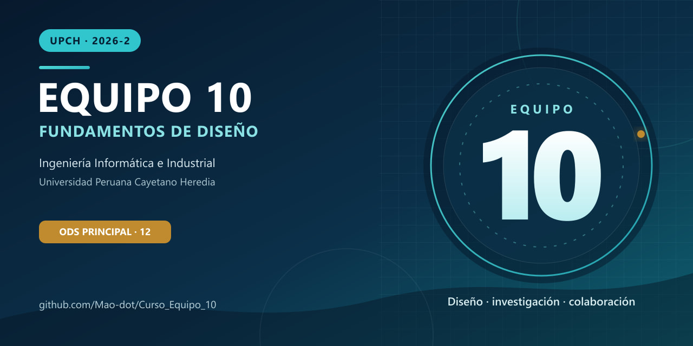
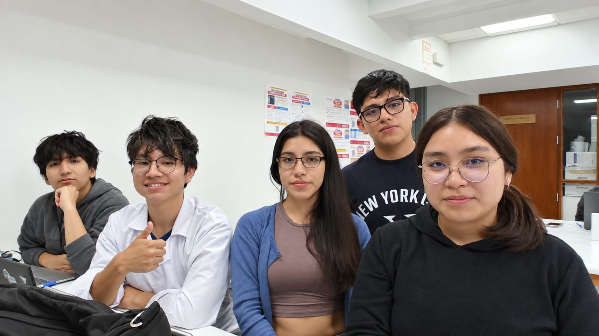

  

<h1 align="center">Equipo 10 — Fundamentos de Diseño</h1>

  <strong>Ingeniería Informática e Ingeniería Industrial · 2026-2</strong> 
  Universidad Peruana Cayetano Heredia

---

## 🌍 Descripción del Equipo
Somos el **Equipo 10** del curso **Fundamentos de Diseño 2026-2**, conformado por estudiantes de las carreras de Ingeniería Informática e Industrial.
Nuestro objetivo es aplicar la metodología de diseño para generar soluciones innovadoras con impacto social, tecnológico y ambiental.

---
## ⚠️ Problemática 

En la vida cotidiana, las personas que desean controlar y conocer mejor su alimentación presentan dificultades para obtener información práctica, inmediata y comprensible sobre la cantidad y la composición nutricional de los alimentos que consumen.

Aunque existen tablas nutricionales, aplicaciones y bases de datos, estas herramientas suelen presentar valores correspondientes a cantidades estandarizadas, como 100 gramos o porciones predeterminadas. Por ello, el usuario debe identificar el alimento, estimar la cantidad servida, consultar distintas referencias e introducir manualmente los datos. Este proceso requiere tiempo y conocimientos previos, puede producir estimaciones poco consistentes y dificulta mantener un seguimiento frecuente.

Esta situación resulta especialmente relevante para las personas que realizan actividad física y buscan conocer regularmente la composición de sus comidas, principalmente la cantidad de proteínas, carbohidratos y grasas presentes en las porciones que consumen.

Por lo tanto, el problema no es necesariamente la ausencia de información nutricional, sino la dificultad para relacionar la información general disponible con la cantidad real de alimento presente en una porción cotidiana. Esta limitación puede reducir la capacidad de las personas para comparar sus porciones y tomar decisiones informadas y conscientes sobre su consumo.

---

## 🎯 Objetivos de Desarrollo Sostenible (ODS)

  
  
  

Nos interesa trabajar en los siguientes **Objetivos de Desarrollo Sostenible (ODS):**
- **ODS 7:** Energía Asequible y No Contaminante
- **ODS 11:** Ciudades y Comunidades Sostenibles
- **ODS 12:** Producción y Consumo Responsables

---

## 📸 Fotografía del Equipo

  

---

## 👥 Integrantes del Equipo
| Foto | Nombre | Rol | Intereses |
|:---:|--------|-----|-----------|
|  | **Mao Arceni Capcha Pumacahua** | Líder del equipo | Programación, análisis de datos, simulación |
|  | **Cruz Oyarce Katherine Jireh** | Encargado de documentación | comunicación científica y redacción técnica |
|  | **Lucero Sofía Tarazona Gonzales** | Responsable de investigación | Gestión ambiental, desarrollo comunitario |
|  | **Renzo Jair Cruz Vega** | Diseñador | Diseño de prototipos, creatividad aplicada |
|  | **Julio Maguiña** | Coordinador de investigación | Investigación, análisis y desarrollo de propuestas |

---

## 📌 Resumen Final
Este README resume quiénes somos, qué nos motiva y en qué ODS queremos enfocar nuestro trabajo durante el curso.
